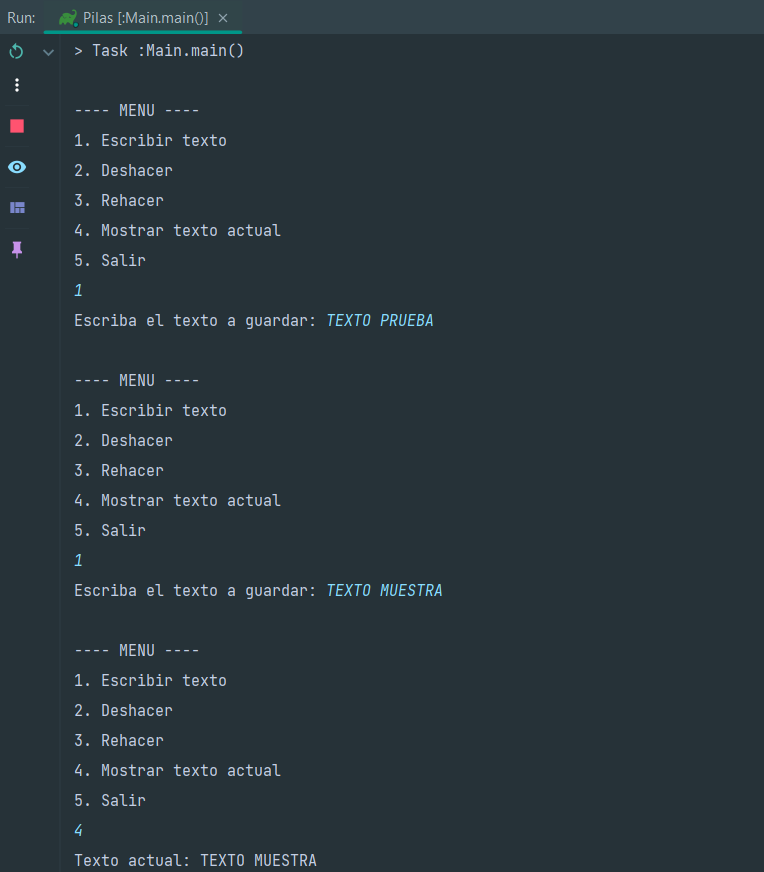
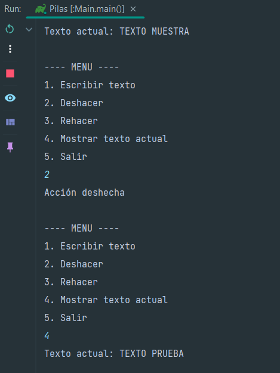
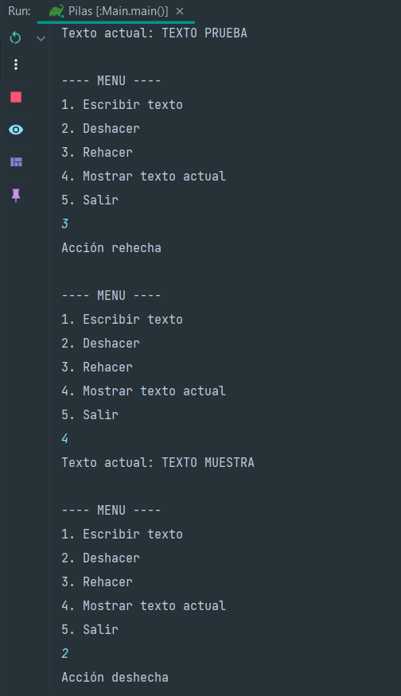
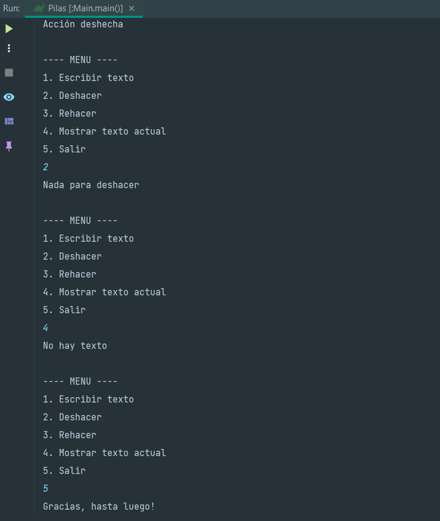

# PILAS - Editor de Texto (Pilas)

Este proyecto es una aplicación de consola desarrollada en **Java** que simula el comportamiento de "Deshacer" (Undo) y "Rehacer" (Redo) en un editor de texto, utilizando estructuras de datos tipo **Pila**.

## 🎯 Objetivo del Proyecto
El programa demuestra el uso de pilas para gestionar el historial de acciones:
1.  **Escribir texto:** Almacena cadenas de texto en una pila principal.
2.  **Deshacer:** Extrae el último texto ingresado y lo mueve a una pila de acciones (historial temporal).
3.  **Rehacer:** Recupera el texto desde la pila de acciones y lo devuelve a la pila principal.
4.  **Gestión de Memoria:** Implementa una clase personalizada de Pila con capacidad definida.

## 🚀 Instrucciones de Ejecución

### Requisitos previos
*   Tener instalado el **JDK (Java Development Kit)** versión 8 o superior.
*   Un IDE (IntelliJ IDEA, Eclipse, NetBeans) o la terminal de comandos.

### Pasos para ejecutar
1.  **Clonar el repositorio:**
    ```bash
    git clone https://github.com/meli0720/PilasIUDigital.git
    ```
2.  **Compilar el programa:**
    ```bash
    javac src/main/java/org/example/*.java
    ```
3.  **Ejecutar:**
    ```bash
    java org.example.Main
    ```

## 🛠️ Estructura del Código
*   `Main.java`: Contiene el menú interactivo y la lógica de control.
*   `Pila.java`: Implementación de la estructura de datos (push, pop, peek, isEmpty, clear).

## 📸 Capturas de Pantalla


| Menú de Opciones | Ejemplo de Deshacer/Rehacer |
| :--- | :--- |
|  |  |
|  |  |
|  |  |

## 👥 Contribuyentes
Proyecto desarrollado por:
*   **Melissa Meneses Acevedo** - [GitHub Profile](https://github.com/meli0720)

---
*Este proyecto fue realizado para la asignatura de Estructuras de Datos.*